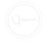
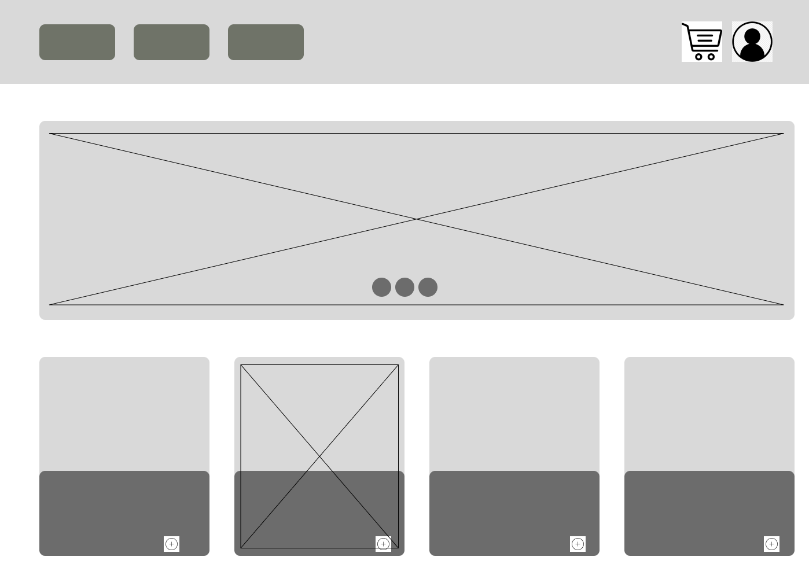
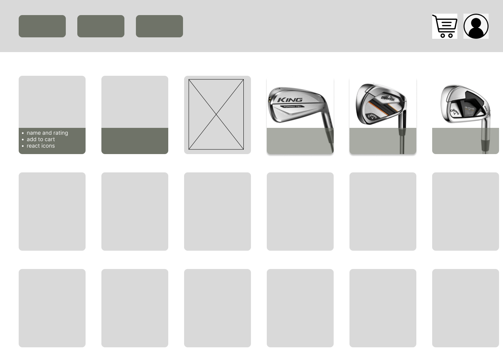
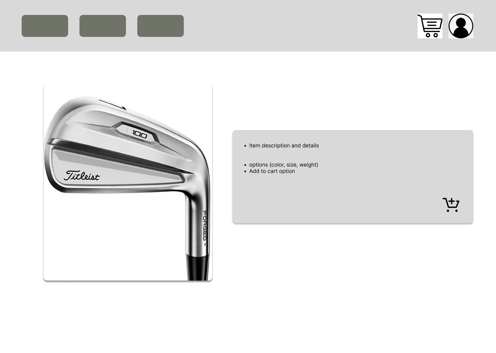

<!-- Repository Information & Links-->
<br />


<!-- HEADER SECTION -->
<h5 align="center" style="padding:0;margin:0;">Liam Wedge</h5>
<h5 align="center" style="padding:0;margin:0;">21100218</h5>
<h6 align="center">DV200 - Term 3 Project | 2022</h6>
</br>
<p align="center">

  <a href="https://github.com/NoSleepTillLambos/TopMart">
    
  </a>
  
  <h3 align="center">Top Mart</h3>

  <p align="center">
    A E-commerce website built by an aspiring full stack developer with a love for golf<br>
    
    
   <br />
   <br />
   <a href="https://drive.google.com/drive/folders/1IiMC4ZpDRhs8Q5RuAk9rlZmzaHfeihNa">View Demo</a>
    ·
    <a href="https://github.com/NoSleepTillLambos/TopMart/issues">Report Bug</a>
    ·
    
</p>
<!-- TABLE OF CONTENTS -->

## Table of Contents

- [About the Project]
  - [Project Description]
  - [Built With](MERN, Mongoose, Nodemon)
- [Getting Started](#getting-started)
  - [Prerequisites](#prerequisites)
  - [How to install](#how-to-install)
- [Features and Functionality](#features-and-functionality)
- [Concept Process](#concept-process)
  - [Ideation](#ideation)
  - [Wireframes](#wireframes)
  - [Custom UI](#user-flow)
- [Development Process](#development-process)
  - [Implementation Process](#implementation-process)
  - [Future Implementation](#peer-reviews)
- [Final Outcome](#final-outcome)
  - [Mockups](#mockups)
  - [Video Demonstration](#video-demonstration)
- [Conclusion](#conclusion)
- [License](#license)
- [Contact](21100218@virtualwindow.co.za)
- [Acknowledgements](#acknowledgements)

<!-- header image of project -->

![image1][image1]

### Project Description

An E-commerce website built using the MERN stack (MongoDB, Express.js, ReactJs and Node). The project has been centred around golf clubs and allows users to browse,search and finally add products to their carts where they can then proceed to checkout.

### Built With

- [React](https://reactjs.org/)
- [Material UI V4](https://v4.mui.com/)
- [Node](https://nodejs.org/en/)
- [MERN](https://www.mongodb.com/mern-stack)

<!-- GETTING STARTED -->
<!-- Make sure to add appropriate information about what prerequesite technologies the user would need and also the steps to install your project on their own mashines -->

## Getting Started

The following instructions will get you a copy of the project up and running on your local machine for development and testing purposes.

### Prerequisites

Ensure that you have the latest version of [NPM](https://www.npmjs.com/) installed on your machine. The [GitHub Desktop](https://desktop.github.com/) program will also be required.

### How to install

### Installation

Here are a couple of ways to clone this repo:

1.  GitHub Desktop </br>
    Enter `https://github.com/NoSleepTillLambos/TopMart` into the URL field and press the `Clone` button.

2.  Clone Repository </br>
    Run the following in the command-line to clone the project:

    ```sh
    git clone https://github.com/NoSleepTillLambos/TopMart
    ```

        Open `Software` and select `File | Open...` from the menu. Select cloned directory and press `Open` button

3.  Install Dependencies </br>
    Run the following in the command-line to install all the required dependencies:

    ```sh
    npm install
    ```

4.  An API key is not required for this installation

<!-- FEATURES AND FUNCTIONALITY-->
<!-- You can add the links to all of your imagery at the bottom of the file as references -->

## Features and Functionality

<!-- note how you can use your gitHub link. Just make a path to your assets folder -->


### Feature 2

Users can browse and view products, descriptions regarding prices and club orientations have been included to make the buyers life a little easier


## Concept Process

A large portion of conceptualization came from websites such as the Pro Shop and The Golfers club, it allowed me to narrow down certain features and include only the necessary features within my site while keeping it clean and user friendly. With a major focus on user interface and user experience.

### Ideation





### Custom UI

A large portion of the UI was developed using Material UI, such as the buttons and other home components (the cards and other display related features)

<!-- DEVELOPMENT PROCESS -->

### Implementation Process

<!-- stipulate all of the functionality you included in the project -->
<!-- This is your time to shine, explain the technical nuances of your project, how did you achieve the final outcome!-->

- Schema development
- Route and backend connections
- Front and backend connection

<!-- MOCKUPS -->

## Final Outcome

### Mockups


<br>


<!-- VIDEO DEMONSTRATION -->

### Video Demonstration

To see a run through of the application, please click below:

[View Demonstration](https://drive.google.com/drive/folders/1bHFGq7nIGPdDqJGrCNNCiSqTUyPk-h7F)

See the [open issues](https://github.com/NoSleepTillLambos/21100218_LiamWedge_DV_project/issues) for a list of proposed features (and known issues).

<!-- AUTHORS -->

## Authors

- **Liam Wedge** - [LiamWedge](https://github.com/NoSleepTillLambos)

<!-- LICENSE -->

## License

Distributed under the MIT License. See `LICENSE` for more information.\

<!-- LICENSE -->

## Contact

- **Liam Wedge** - [liamwedge00@gmail.com]
- **Project Link** - https://github.com/NoSleepTillLambos/TopMart

<!-- ACKNOWLEDGEMENTS -->

## Acknowledgements

<!-- all resources that you used and Acknowledgements here -->

- [Pro Shop](https://www.theproshop.co.za/)
- [Golfers club](https://www.golfersclub.co.za/)
- [MERN stack](https://www.mongodb.com/mern-stack)
- [Nodemon](https://www.npmjs.com/package/nodemon)
- [Mongoose](https://mongoosejs.com/)
